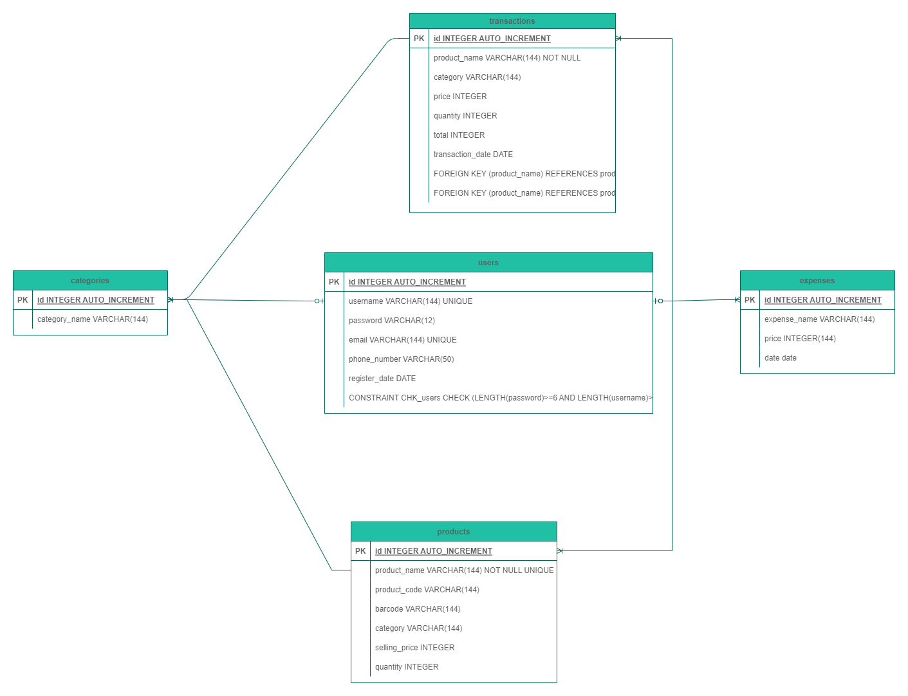
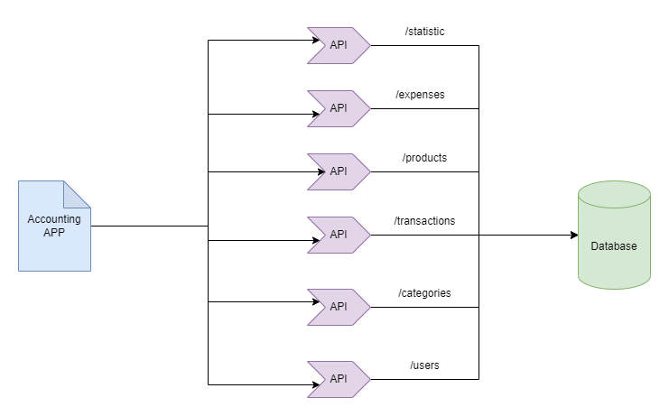

<H1>Accounting App</h1>
<h2>Entity Relational Diagram</h2>
  
<h2>Architecture Diagram</h2>
  
<h2> API </h2>

Open Collections in this folder with name Accounting App.postman_collection.json
 
<h2>Requirements Package</h2>

Open Requirements Package in this folder with name requirements.txt